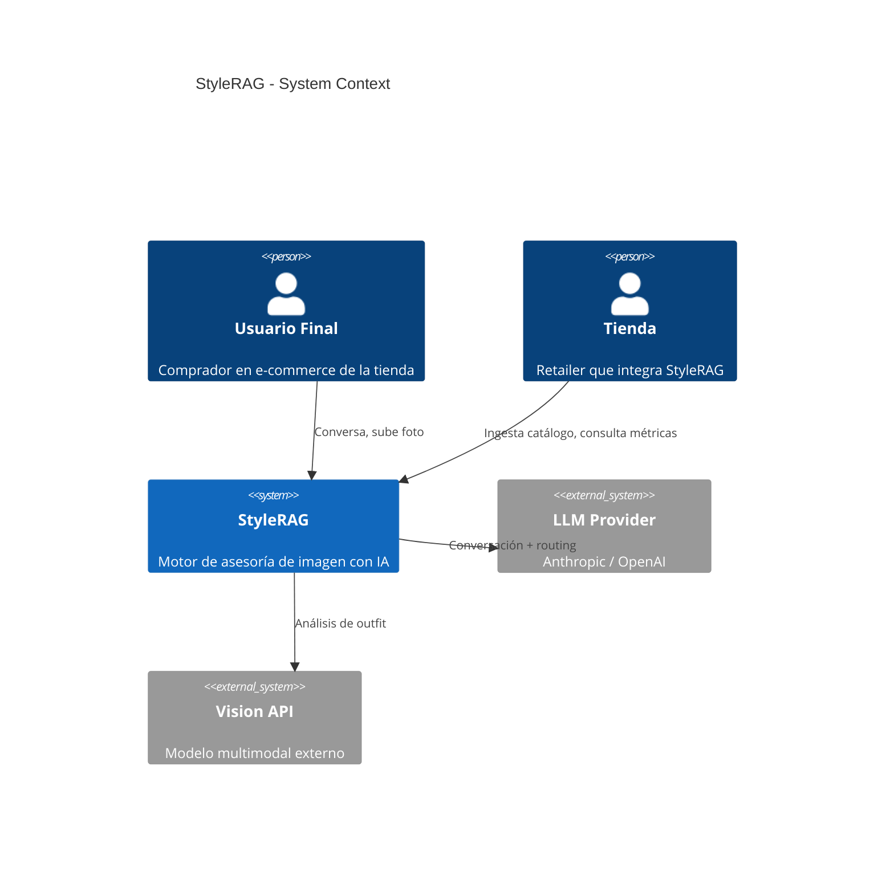
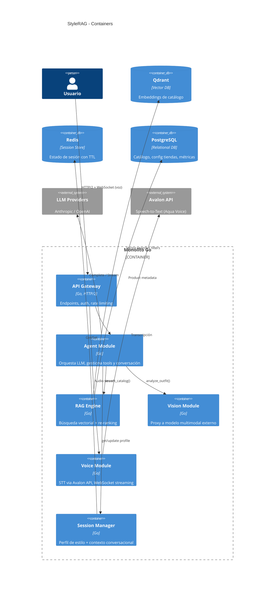
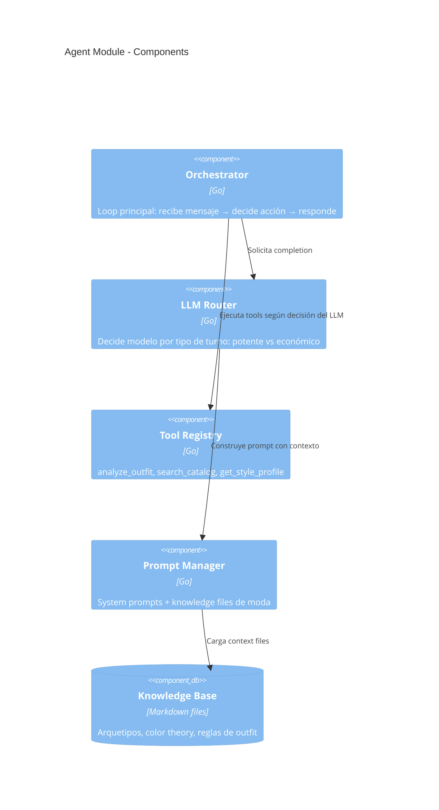
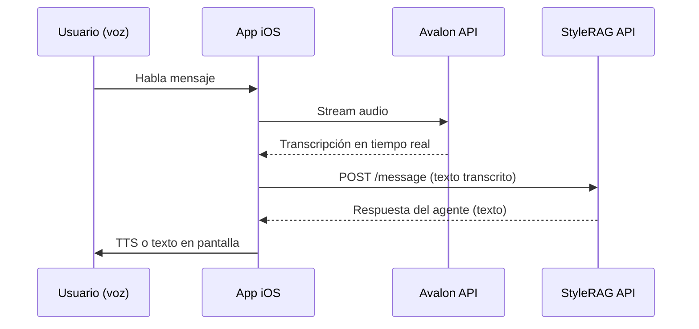
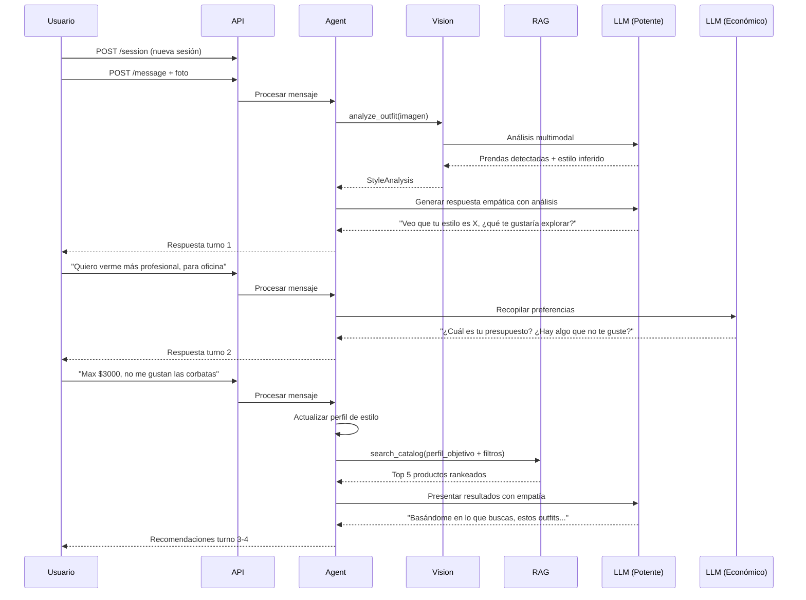
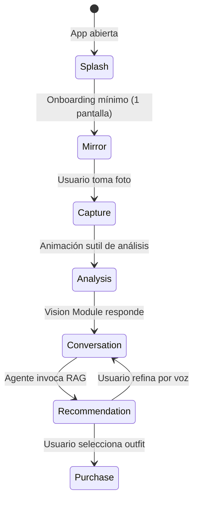

# StyleRAG — System Design Document
**v1.0 | Febrero 2026 | CONFIDENCIAL**

---

## 1. Resumen Ejecutivo

StyleRAG es un motor de asesoría de imagen con IA, vendido B2B a tiendas de moda. Las tiendas integran StyleRAG en su e-commerce para reemplazar la búsqueda de catálogo tradicional con un asesor conversacional que analiza el estilo actual del usuario (vía foto), entiende su intención emocional, y recomienda outfits completos del inventario real.

**Hipótesis:** *"Un agente de IA que combina análisis visual + conversación empática + conocimiento de moda contextualizado genera recomendaciones que el usuario percibe como una mejora realista de su imagen, resultando en mayor conversión que búsqueda tradicional."*

**Propuesta de valor:**
- Para tiendas: mayor conversión, ticket promedio más alto, menos devoluciones
- Para el usuario: eliminar la fricción emocional de pedir ayuda con su imagen

---

## 2. Contexto de Mercado

### Mercado global IA en moda
- ~USD 2.2B en 2024, CAGR >39%, proyección USD 40-60B para 2034
- Recomendación de producto domina; asistentes virtuales emergiendo como app más influyente 2026

### México
| Indicador | Valor | Año |
|---|---|---|
| E-commerce MX total | ~USD 54.4B | 2025 |
| Fashion e-commerce MX | ~USD 8,880M | 2024 |
| Crecimiento fashion YoY | 25-30% | 2024 |
| Tasa abandono carrito | ~86% | 2024 |
| Compras moda online/año | 6.1 veces | 2024 |

### Competencia
| Competidor | Modelo | Diferenciador StyleRAG |
|---|---|---|
| Stitch Fix | B2C, suscripción + estilistas + IA | B2B puro, sin inventario propio |
| Lily AI | B2B, atributos de producto | Va más allá: intención emocional + transformación de estilo |
| Aiuta | B2B/B2C, virtual try-on | Enfoque conversacional + visión, no solo probador |
| Zalando chatbot | B2C, ChatGPT integrado | Motor desacoplado vendible a cualquier retailer |

**Oportunidad:** Con 86% abandono de carrito y 2-3% conversión en moda MX, mover 1-2 puntos es ROI inmediato. No hay competidor B2B en LATAM con este enfoque.

---

## 3. Scope del PoC

| Dimensión | Definición |
|---|---|
| Segmento | Hombres 25-35, clase media |
| Estilo | Smart casual / casual elevado |
| Ocasiones | Trabajo remoto, salidas, citas |
| Dataset | Fashion Product Images (Kaggle, ~44K) |
| Input | Foto estática |
| Output | Recomendaciones de outfit completo |

**Roadmap:** V1 (PoC) → V2 (moda femenina + catálogo real) → V3 (espejo AR + modelo propio)

---

## 4. Arquitectura

### C4 — Context



### C4 — Container



### C4 — Component (Agent Module)



---

## 5. Interacción por Voz

La interacción principal del usuario es por voz desde V1. Hablar es más natural que escribir cuando describes cómo quieres sentirte — baja la fricción al máximo y hace el PoC mucho más diferenciado.

### Speech-to-Text: Avalon API (Aqua Voice)
- **API:** Compatible con OpenAI Whisper (drop-in, 2 líneas de cambio)
- **Accuracy:** 97.3% en AISpeak benchmark
- **Precio:** $0.39/hora de audio
- **Endpoint:** `https://api.aqua.sh/v1`
- **Modelo:** `avalon-1`
- **Features:** Speaker labels, timestamps, streaming

### Integración en el flujo


### Módulo Voice en el monolito
Se agrega `internal/voice/` con:
- `transcriber.go` — Client para Avalon API (compatible OpenAI SDK)
- `handler.go` — Endpoint WebSocket para streaming de audio

### Consideraciones
- **Idioma:** Validar accuracy de Avalon en español (benchmark actual es inglés técnico)
- **Fallback:** Si Avalon no soporta español bien, Whisper large-v3 como alternativa
- **TTS (respuesta):** Por definir — puede ser texto en pantalla para V1, voz sintética para V2
- **Costo adicional:** ~15-30 segundos de audio por turno × 4-6 turnos = ~2 min/sesión ≈ $0.013/sesión

### Costo total estimado por sesión con voz
| Concepto | Costo |
|---|---|
| LLM (routing mixto) | ~$0.020 |
| STT (Avalon, ~2 min) | ~$0.013 |
| **Total por sesión** | **~$0.033** |

---

## 6. Flujo de Conversación



---

## 6. Modelo de Datos

### Perfil de Estilo (sesión)
```json
{
  "current_style": ["casual básico", "streetwear"],
  "target_style": ["smart casual", "casual elevado"],
  "color_preferences": { "likes": ["neutros"], "dislikes": ["neón"] },
  "fit_preference": "slim pero cómodo",
  "occasions": ["oficina remota", "cena casual"],
  "budget_range": { "min": 500, "max": 3000, "currency": "MXN" },
  "restrictions": ["no corbatas", "no estampados florales"],
  "transformation_level": "gradual"
}
```

### Producto (catálogo en Qdrant)
```json
{
  "id": "store_product_123",
  "name": "Chino slim fit beige",
  "description": "Pantalón chino de algodón...",
  "category": "bottoms",
  "subcategory": "chino",
  "color": ["beige", "arena"],
  "fit": "slim",
  "style_tags": ["smart casual", "minimal", "oficina"],
  "price": 1299.00,
  "sizes": ["28", "30", "32", "34"],
  "image_url": "https://...",
  "embedding": [0.123, -0.456, ...]
}
```

---

## 7. Estrategia LLM

### Diseño agnóstico
Interface `LLMProvider` con adapter pattern. Cada provider implementa `Complete()` y `StreamComplete()`.

### Routing inteligente
| Tipo de turno | Modelo | Razón |
|---|---|---|
| Análisis de imagen | Potente (Sonnet/GPT-4o) | Requiere visión multimodal |
| Recopilación de preferencias | Económico (Haiku/4o-mini) | Solo recopila, sin razonamiento complejo |
| Traducción a perfil de estilo | Potente | Paso crítico: intención emocional → atributos |
| Presentación de resultados | Potente | Empatía + explicación del porqué |

### Costo estimado por sesión: ~$0.02 USD (4-6 turnos, routing mixto)

---

## 8. Stack Tecnológico

| Componente | Tecnología | Justificación |
|---|---|---|
| Lenguaje | Go | Performance, goroutines, binario único |
| Vector DB | Qdrant | Rust, filtrado + vectorial, client Go |
| Session Store | Redis | TTL nativo, bajo overhead |
| LLM | Anthropic / OpenAI (agnóstico) | Adapter pattern |
| Embeddings | TBD (CLIP / text-embedding-3) | Necesita benchmark |
| Catálogo DB | PostgreSQL | Metadata, config tiendas |
| Deploy | Docker + fly.io / Railway | Monolito, bajo costo |

---

## 9. Estructura del Proyecto

```
stylerag/
├── cmd/server/main.go
├── internal/
│   ├── agent/          # Orchestrator, tools, prompts
│   ├── rag/            # Engine, embedder, ingest pipeline
│   ├── vision/         # Analyzer (proxy a modelo externo)
│   ├── voice/          # Avalon STT client, WebSocket handler
│   ├── llm/            # Provider interface, adapters, router
│   ├── session/        # Redis store, profile builder
│   ├── catalog/        # PostgreSQL repo, CSV/JSON importer
│   └── api/            # Handlers, middleware, DTOs
├── knowledge/          # Style archetypes, color theory, outfit rules (.md)
├── config/
└── Dockerfile
```

---

## 10. Cliente iOS

### Filosofía de diseño
La app es un **espejo inteligente en el bolsillo**. Una sola pantalla principal que evoluciona por fases, sin navegación compleja, sin formularios. Sensación de lujo = quitar todo lo que sobra.

### Tecnología
- **Swift nativo** — performance, cámara, micrófono, haptics, animaciones fluidas
- **Arquitectura:** MVVM + Combine/async-await
- **Comunicación:** HTTP/2 para mensajes, WebSocket para streaming de voz

### Flujo UX — Pantalla única evolutiva



### Fases de la pantalla principal

**Fase 1 — Espejo (Mirror)**
- Cámara frontal a pantalla completa
- El usuario se ve como en un espejo
- Texto sutil: "Cuando estés listo, tómate una foto con lo que traes puesto"
- Un solo botón de captura, elegante, sin distracciones
- Sin filtros, sin marcos, sin UI innecesario

**Fase 2 — Captura (Capture → Analysis)**
- La foto se congela con transición suave
- Animación minimalista indica análisis en curso
- La foto se desenfoca gradualmente preparando la transición

**Fase 3 — Conversación (Conversation)**
- Foto del usuario de fondo, difuminada
- El agente "habla" por primera vez (texto + TTS futuro)
- Se activa el micrófono — el usuario responde con voz
- La transcripción aparece como texto sutil, no como burbujas de chat
- Sin UI de mensajería tradicional — es una conversación ambiental

**Fase 4 — Recomendación (Recommendation)**
- Los outfits aparecen como cards flotantes sobre el fondo
- El usuario puede comparar visualmente "yo ahora" vs "outfit sugerido"
- Interacción por voz para refinar: "me gusta pero en otro color"
- Cada card muestra: imagen del producto, precio, nombre, por qué se recomienda
- Swipe para explorar alternativas

### Principios de diseño
- **Espacio:** Mucho whitespace, tipografía elegante, colores neutros
- **Ritmo:** Transiciones lentas e intencionales, nunca abruptas
- **Minimalismo:** Máximo 1 acción visible por fase
- **Voz primero:** El micrófono es el input principal, texto es secundario
- **Continuidad:** Nunca se pierde la referencia visual del usuario

### Estrategia de lanzamiento
- **iOS exclusivo** al inicio — señal de exclusividad
- **Web lista pero gated** — landing page con waitlist
- **FOMO:** "Disponible solo en iOS. Web próximamente." Generar demanda antes de abrir
- **TestFlight beta** para primeros usuarios, invitaciones limitadas

### Estructura del proyecto Xcode
```
StyleRAG/
├── App/
│   └── StyleRAGApp.swift
├── Core/
│   ├── Network/          # API client, WebSocket manager
│   ├── Voice/            # Micrófono, Avalon STT streaming
│   └── Camera/           # Captura de foto, permisos
├── Features/
│   ├── Mirror/           # Fase espejo + captura
│   ├── Conversation/     # Fase conversación ambiental
│   └── Recommendation/   # Cards de outfits + refinamiento
├── Design/
│   ├── Theme.swift       # Colores, tipografía, spacing
│   ├── Animations.swift  # Transiciones entre fases
│   └── Components/       # Botones, cards, indicadores
└── Resources/
    └── Assets.xcassets
```

---

## 11. Métricas

### Negocio (KPIs para la tienda)
| Métrica | Target PoC |
|---|---|
| Tasa de conversión | > 5% (vs 2-3% baseline) |
| Ticket promedio | > 20% vs búsqueda normal |
| Tasa de devolución | < 20% (vs ~30% baseline) |
| NPS del asesor | > 40 |

### Calidad RAG
| Métrica | Cómo se mide |
|---|---|
| Relevancia | CTR + compras sobre recomendaciones |
| Diversidad | Categorías/estilos distintos por sesión |
| Coherencia de outfit | Evaluación humana + reglas automáticas |
| Gradualidad | Distancia vectorial estilo actual vs recomendado |
| Latencia p95 | Target: < 2s incluyendo LLM |

---

## 12. Evaluación de la Sesión de Diseño

### Lo que se definió bien
- **Pivote B2C → B2B temprano:** elimina las barreras más costosas y enfoca en el diferenciador real
- **Segmento acotado:** hombres 25-35 smart casual, reglas formulables, dataset manejable
- **Insight del usuario:** la fricción emocional como problema central diferencia de motores de recomendación genéricos
- **Go sobre Python:** priorizar performance y costo por request para producto B2B
- **Routing de modelos:** ~$0.02/sesión es viable
- **Approach mayeútico:** cada decisión se derivó de una pregunta, no se asumió nada

### Riesgos y áreas abiertas
- **Modelo de embeddings no definido:** necesita benchmark (CLIP vs text-embedding-3 vs Cohere)
- **Knowledge base de moda:** se mencionó pero no se definió contenido, requiere investigación con asesores reales
- **Validación de mercado:** no hay evidencia de que tiendas mexicanas pagarían, se necesita al menos una conversación exploratoria
- **Definición de "buena recomendación":** la métrica de gradualidad es prometedora pero no validada
- **Pricing model B2B:** ¿por sesión? ¿por conversión? ¿SaaS mensual? No discutido

### Próximos pasos
1. Descargar dataset Kaggle y explorar atributos
2. Benchmark de embeddings con queries de estilo sobre el dataset
3. Scaffolding del proyecto Go: estructura, interfaces, health check
4. Pipeline de ingesta: cargar dataset en Qdrant
5. Primer query funcional: "quiero verme smart casual" → productos relevantes
6. Conversación exploratoria con al menos un retailer mexicano
